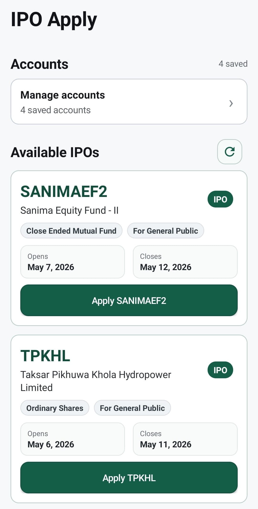

<div align="center">


# IPO Apply

**A tiny native Android app for applying IPO from multiple accounts in one click.**


</div>

---

## Overview

IPO Apply is a lightweight Android app built for fast MeroShare IPO workflows. It lets users save multiple MeroShare accounts, view available IPOs, check whether each account has already applied, and apply for selected accounts with fewer repeated steps.

The app is intentionally built with a **minimum-size, native-first** philosophy:

- No Compose
- No Material Components
- No external UI libraries
- No image-heavy UI
- Native Android Views only
- Small release APK target

---

## Design Principles

> Small, fast, native, practical.

This project avoids heavy frameworks and favors direct Android platform APIs. Most UI is generated from Kotlin using `LinearLayout`, `TextView`, `Button`, `ImageView`, and `GradientDrawable`.

---

## Preview

<div align="center">
  <table>
    <tr>
      <td align="center">
        
        <br />
        <sub><strong>Home</strong></sub>
      </td>
    </tr>
  </table>
</div>

## How to Build

### What you need

- [Java JDK 11 or higher](https://adoptium.net/) installed and added to PATH
- The signing files set up (see Step 1 below)

---

### Step 1 — Set up your signing files

Two secret files are **not included in the repo** and must be set up on every new machine:

- `keystore/key.p12` — the keystore file
- `keystore.properties` — the passwords and path for the keystore

Create `keystore.properties` in the root of the project:

```properties
storeFile=keystore/key.p12
storePassword=your_password
keyAlias=upload
keyPassword=your_password
```

**Don't have a keystore yet?** Run this once in PowerShell to generate one:

```powershell
keytool -genkeypair `
  -v `
  -keystore keystore/key.p12 `
  -storetype PKCS12 `
  -alias upload `
  -keyalg RSA `
  -keysize 2048 `
  -validity 10000 `
  -storepass YOUR_PASSWORD `
  -keypass YOUR_PASSWORD `
  -dname "CN=Your Name, OU=IPO Apply, O=IPO Apply, L=Kathmandu, ST=Bagmati, C=NP"
```

> Replace `YOUR_PASSWORD` with any password you choose. Keep the `.p12` file backed up safely — **if you lose it, you cannot publish updates to the Play Store.**

---

### Step 2 — Build the APK

```powershell
.\gradlew.bat assembleRelease
```

---

### Step 3 — Find your APK

```
app/build/outputs/apk/release/app-release.apk
```

---

## Disclaimer

This is an independent project and is not affiliated with CDSC, MeroShare, or any official financial institution. Use carefully and verify applications through official channels when needed.

---

<div align="center">

Built with a stubborn love for tiny native apps.

</div>
